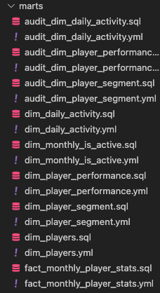

# Chess.com Analytics Project

This capstone project analyzed how chess grandmasters engage with [Chess.com](http://chess.com/) using data from its open-source API. The study examined over 8 million chess games by extracting player profiles, performance statistics, and gameplay records to understand player activity and performance. Through performance segmentation and RFE (Recency, Frequency, and Engagement) analysis, the project revealed how these elite players use the platform and their playing patterns.

The project also included a daily engagement report that tracked player activity changes over time, offering a dynamic view of usage trends. This thorough analysis provided valuable insights into top players' behavior on the platform.

### Technologies Used

To execute the project efficiently, the following technologies and tools were utilized:

- **Snowpark:** Used to extract data seamlessly from the Chess.com API, enabling robust and scalable data processing.
- **Snowflake:** Employed as the database to store and manage the extensive dataset, including over 8 million chess games and related player statistics.
- **dbt (Data Build Tool):** Utilized for data transformation and documentation, ensuring clean, structured, and easily queryable data models.
- **Tableau:** Used for data visualization to create insightful dashboards, including the daily engagement report and segmentation analyses.

These tools collectively streamlined the end-to-end data pipeline, from extraction and storage to transformation and visualization, ensuring a smooth and efficient workflow.

### Methodology

### Step 1: Fetch Data from the API

### 1.1 Fetch Player Names

The process began by retrieving the names of titled chess players using the following endpoint:

```python
#python
titled_api_url = "https://api.chess.com/pub/titled/{title_abbrev}"
titles = ["GM", "WGM"]
```

Quality checks were performed to ensure the data was accurate and complete.


### 1.2 Fetch Player Profiles

Using the usernames of these players, their profiles were fetched from the API:

```python
#python
player_api_url = "https://api.chess.com/pub/player/{username}"
```


### 1.3 Fetch Player Stats

Player statistics were retrieved using the stats API endpoint:

```python
#python
stats_api_url = "https://api.chess.com/pub/player/{username}/stats"
```


### 1.4 Fetch Player Games

Gameplay data for all players was collected using their username along with the year and month:

```python
#python
games_api_url = "https://api.chess.com/pub/player/{username}/games/{YYYY}/{MM}"
```

- **Challenges:** Backfilling data for all 1,865 players took 17 hours. Subsequent incremental refreshes take approximately 30–45 minutes daily.


---

### Data Quality and Pipeline Management

- **WAP Methodology:** New data was loaded into a temporary table and subjected to rigorous quality checks, including tests for duplicates and outliers. Only after passing these checks was the data merged into the production table.
- **Idempotency:** The pipelines were designed to be idempotent, ensuring consistent results even if the process was repeated.
- **Optimization with ETag:** To minimize redundant fetches, ETag headers were used to check if new data was available for a given player. If the ETag indicated no new data, that user was skipped, significantly improving pipeline efficiency.

**Example of one Test**


### Step 2: Define Key Questions and Analytical Objectives

To guide the analysis, a set of core questions and objectives was established, focusing on player engagement, game dynamics, and segmentation:

### Key Questions:

1. **Daily Engagement Metrics:**
    - How many games are played daily?
    - What types of games are played (Rapid >5 mins, Blitz 3–5 mins, Bullet <3 mins)?
    - How many unique users are active on a daily basis?
2. **Player Segmentation:**
    - **RFE Segmentation:** Segment players based on **Recency, Frequency, and Engagement** using the last 1 year of data. This segmentation refreshes monthly to incorporate the most recent 12 months of data.
    - **Performance Segmentation:** Classify players based on their performance metrics to identify trends and patterns in player success.
3. **Dimensional Insights:**
    - Analyze player distribution by **location** to understand regional engagement and activity levels.
4. **Individual Player Performance:**
    - Dive deeper into each player's performance on Chess.com, evaluating key metrics to understand how they are performing over time.

### Approach:

- The analysis used data from the past year to ensure relevance and robustness.
- For segmentation, both RFE and performance criteria were applied, enabling targeted and actionable insights.

### RFE Segmentation

The RFE segmentation was designed to classify players based on three key behavioral metrics:

1. **Recency:** Measures the **most recent activity** of a player, defined by the date of their last recorded game. This helps identify how recently a player engaged with the platform.
2. **Frequency:** Tracks the **number of distinct days** a player has been active. This captures the consistency of their engagement over time.
3. **Engagement:** Quantifies the **total number of games played** by a player, providing insights into their overall activity level.

This segmentation framework offers a comprehensive view of player behavior, allowing for targeted analysis of player activity patterns and engagement trends. By combining these three dimensions, the analysis can differentiate between occasional users, consistent players, and highly engaged participants.

### Step 3: Designing Data Models in dbt

Once the key questions were identified, the data model was designed to support efficient querying and analysis. The star schema was adopted to organize the data, ensuring a balance of simplicity and performance. Incremental models were implemented using dbt, following the **WAP methodology** to maintain data quality.

For more details, feel free to generate dbt docs!




### Step 4: Designing the DAG

To orchestrate the end-to-end workflow, a Directed Acyclic Graph (DAG) was designed to automate the sequential execution of tasks, ensuring efficient and error-free data processing. The DAG is scheduled to run daily, ensuring the pipeline remains updated with the latest data.

### Workflow:

1. **API Logic:**
    - The DAG begins with fetching data from the Chess.com API, including player profiles, stats, and game data.
    - This step ensures that the latest data is collected and prepared for transformation.
2. **dbt Runs with Cosmos:**
    - After the API logic, the DAG triggers **dbt models** for data transformation and schema generation using **Cosmos**.
    - Cosmos handles the orchestration of dbt tasks within the DAG, ensuring incremental models are built and refreshed daily, following the WAP methodology.

### Daily Refresh:

- The DAG is scheduled to run once every day, automatically fetching new data and updating transformed tables. This ensures that analysis and reports are always based on the most recent information.

By leveraging the DAG with Cosmos for dbt runs and ensuring daily refreshes, the project achieves a fully automated and up-to-date pipeline for reliable data processing and analysis.


### Step 5: Designing the Visualization in Tableau

The Tableau dashboard was designed with three tabs to provide a comprehensive view of player engagement, activity, and location-based insights. Each tab highlights a unique aspect of the analysis:

### **1. Overview Tab**

This tab offers a high-level summary of player engagement and game trends:

- **Games Trend:** Displays the total number of games played weekly, highlighting fluctuations over time.
- **Daily Active Players:** Tracks the daily count of active players, showing the variation in user activity.
- **Trend Split by Game Type:** Visualizes the proportion of games played across different game types (Rapid, Blitz, Bullet) on a weekly basis. This bar chart provides a clear breakdown of player preferences.

Filters on the right allow users to drill down by **calendar date**, **game type**, **player category**, **region**, and more, enabling granular exploration of trends.


---

### **2. Player Location Tab**

This tab maps player activity geographically:

- **Games by Player Location:** A world map visualizes the distribution of games played across different countries and regions.
- Each bubble represents the number of games, with larger bubbles indicating higher activity levels.
- Filters on the right enable analysis by **game type**, **player category**, **rules**, **region**, and **segment**, providing a detailed view of player engagement by location.

This visualization is essential for identifying regional engagement trends and hotspots of player activity.


---

### **3. Player Stats Tab**

This tab dives into detailed performance and activity metrics for individual players:

- **Player Rating and Games:** Combines a line chart for average player ratings with a bar chart showing the number of games played weekly.
- **Player Stats:** Stacked bar charts display individual player performance, categorized by outcomes (wins, losses, draws, and games not played).
- Filters allow for player-specific insights by **name**, **game type**, **segment**, and other categories.

This tab provides a player-centric view, helping to analyze performance trends and engagement for individual players.


### Possible Future Enhancements

To further improve the analysis and enhance the usability of insights, the following future enhancements are proposed:

1. **Develop a Clickable UI:**
    - Transition from Tableau to a custom, clickable user interface that provides a more interactive and user-friendly experience.
    - Include dynamic filters and drill-down capabilities to make it easier for end users to explore the data and numbers intuitively.
2. **Expand Beyond GM Data:**
    - Extend the analysis beyond grandmasters (GMs) to include data from all Chess.com users, encompassing approximately 100 million accounts.
    - Analyze global player engagement trends, performance patterns, and behavioral differences among various player categories.
3. **Add Head-to-Head (H2H) Records:**
    - Incorporate head-to-head statistics for grandmasters to provide insights into their performance against other titled players.
    - Highlight rivalries and trends in direct competitions.
4. **Include Tournaments and Clubs Data:**
    - Integrate data on tournaments and chess clubs to understand how players interact with these features.
    - Explore whether participating in tournaments or joining clubs improves player engagement and performance.
5. **Analyze Opening and Middle Game Strategies:**
    - Examine the opening and middle game lines played by the players and assess their impact on game outcomes.
    - Identify trends and patterns in successful strategies, highlighting key moves and their influence on win, loss, or draw rates.

These enhancements will broaden the scope of the project, add depth to the analysis, and improve the accessibility and utility of insights for a wider audience.
